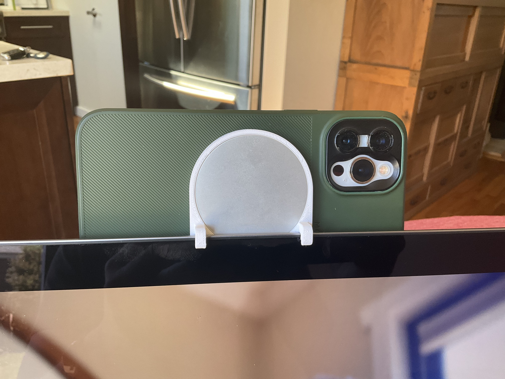

# continuity-camera-mount

## Description

A mount to use your iOS 16 MagSafe equipped iPhone as a Continuity Camera for an iMac Pro.

See https://www.theverge.com/2022/6/7/23158510 for more information.

Link to original .shapr source file. https://github.com/schwa/continuity-camera-mount

Printable Link: https://www.printables.com/model/225801-imac-pro-continuity-camera-mount

### Render of mount on an iMac Pro

### Mount in use on an iMac Pro

### MacBook Pro mount in use

## Model Files:

### MacBook Pro

This design is for MacBook Pro (tested on 16" M1 MacBook Pro) but should fit any display that is ~5mm deep.

* [3mf (for printing)](Models/MacBook%20Pro%20Coherence%20Camera%20Mount.3mf)
* [Shapr3D (original model)](Models/MacBook%20Pro%20Coherence%20Camera%20Mount.shapr)
* [Step (CAD interchange)](Models/MacBook%20Pro%20Coherence%20Camera%20Mount.step)
* [USDZ (for AR viewing)](Models/MacBook%20Pro%20Coherence%20Camera%20Mount.usdz)

### iMac Pro

This design is contoured to fit well on the back of an iMac Pro. It may work with other iMacs but is unlikely to work on the new Apple Silicon iMaps (perhaps the MacBook design one will work?)

* [3mf (for printing)](Models/iMac%20Pro%20Continuity%20Camera%20Mount.3mf)
* [Shapr3D (original model)](Models/iMac%20Pro%20Continuity%20Camera%20Mount.shapr):
* [Step (CAD interchange)](Models/iMac%20Pro%20Continuity%20Camera%20Mount.step)
* [USDZ (for AR viewing)](Models/iMac%20Pro%20Continuity%20Camera%20Mount.usdz)

## License

[This work is licensed under a
Creative Commons (International License)
Public Domain](https://creativecommons.org/share-your-work/public-domain/cc0/)
