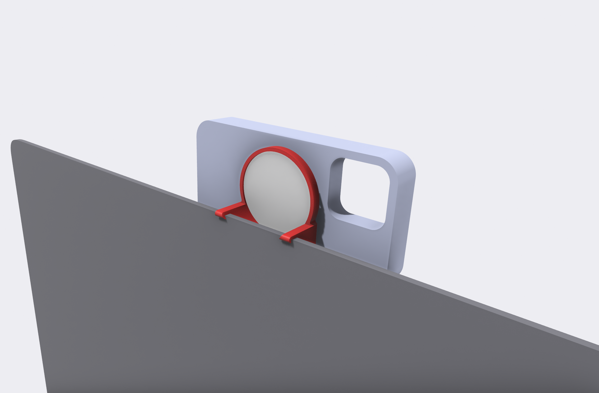
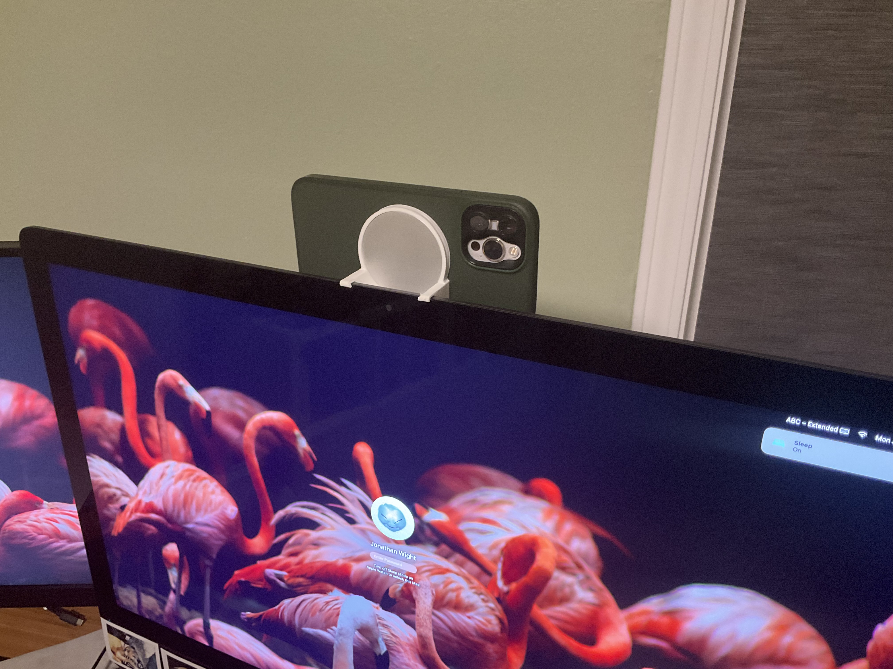

# continuity-camera-mount

## Description

A mount to use your iOS 16 MagSafe equipped iPhone as a Continuity Camera for an iMac Pro.

See https://www.theverge.com/2022/6/7/23158510 for more information.

Link to original .shapr source file. https://github.com/schwa/continuity-camera-mount

Printable Link: https://www.printables.com/model/225801-imac-pro-continuity-camera-mount

## Model Files:

* [Shapr3D (original model)](iMac%20Pro%20Continuity%20Camera%20Mount.shapr):
* [3mf (for printing)](iMac%20Pro%20Continuity%20Camera%20Mount.3mf)
* [Step (CAD interchange)](iMac%20Pro%20Continuity%20Camera%20Mount.step)
* [USDZ (for AR viewing)](iMac%20Pro%20Continuity%20Camera%20Mount.usdz)

## License

[This work is licensed under a
Creative Commons (International License)
Public Domain](https://creativecommons.org/share-your-work/public-domain/cc0/)
